# My iOS/macOS projects

## SecondWallet

### What is SecondWallet 

 

SecondWallet is the alternative for you to not worry anymore about that code you need in that moment!

Because all information is kept locally, you don't need to worry about getting caught in the wrong hands, it will be like protecting ting your own wallet that you carry everyday but instead of having the cards it will have all the details you need to access it.

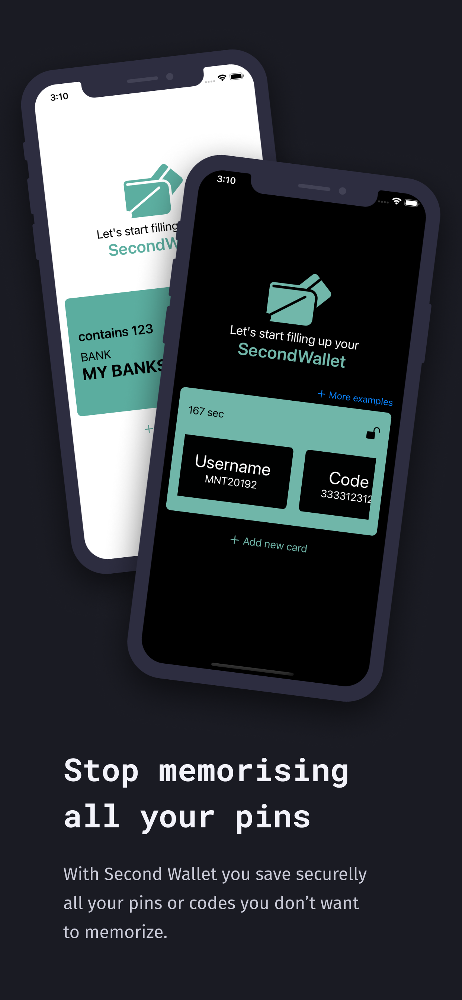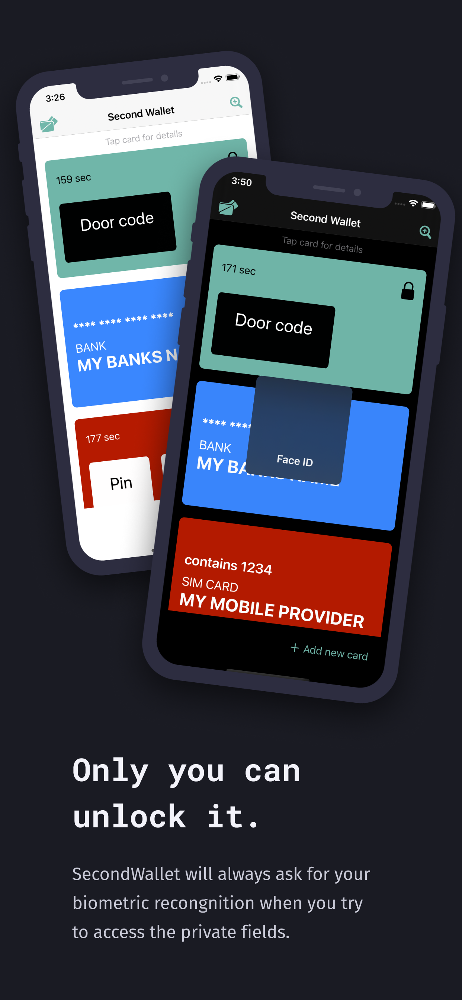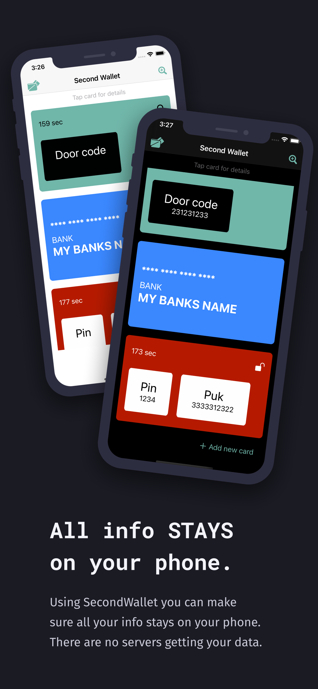

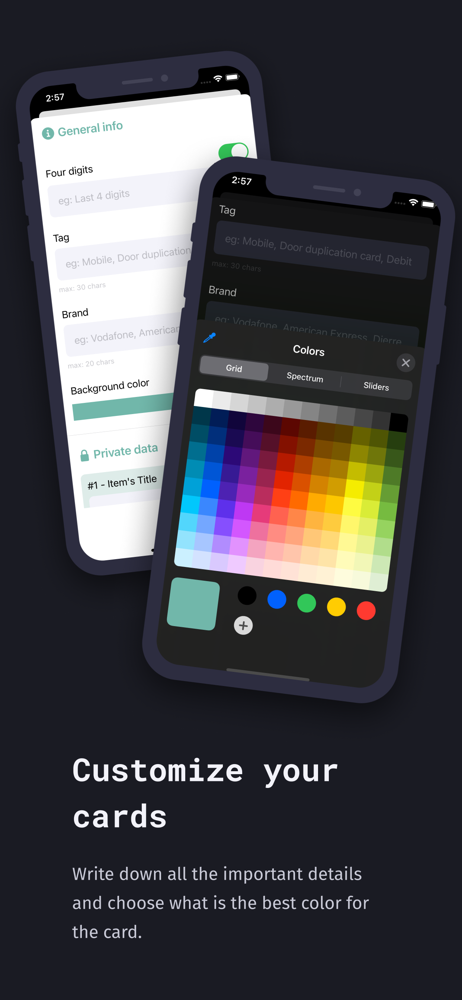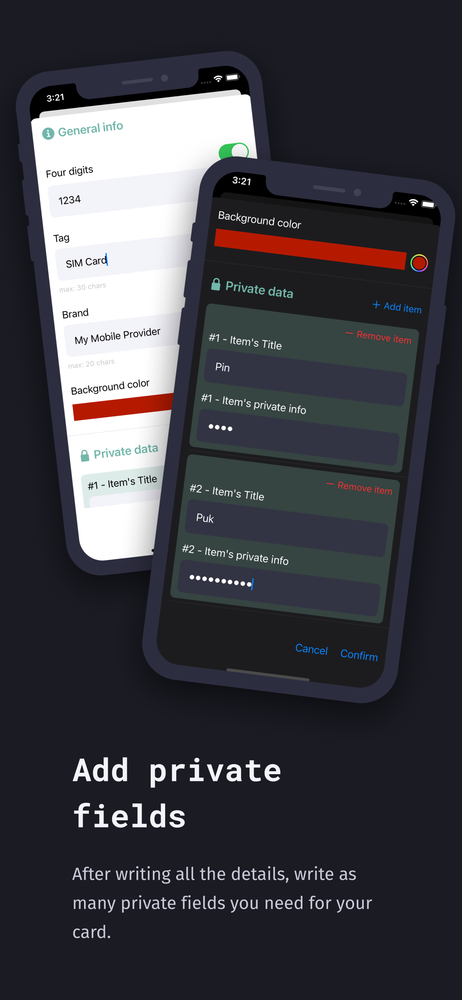

## ClipToCloud

### What is ClipTocloud 

ClipToCloud is a software that allows you to store all your copies in a customised clipboard all around your iOS devices. You only need to use the normal ⌘+C shortcut on your laptop and you can access to it on all your iOS devices.

 

 

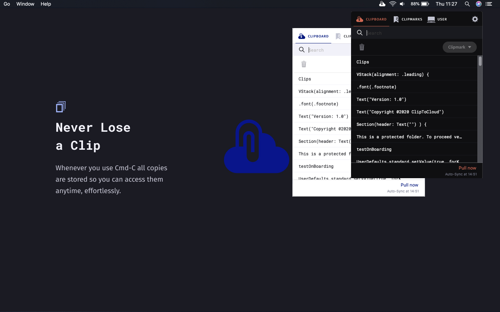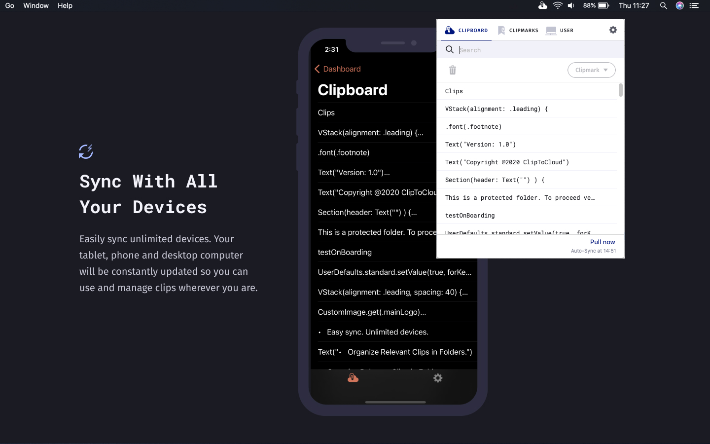

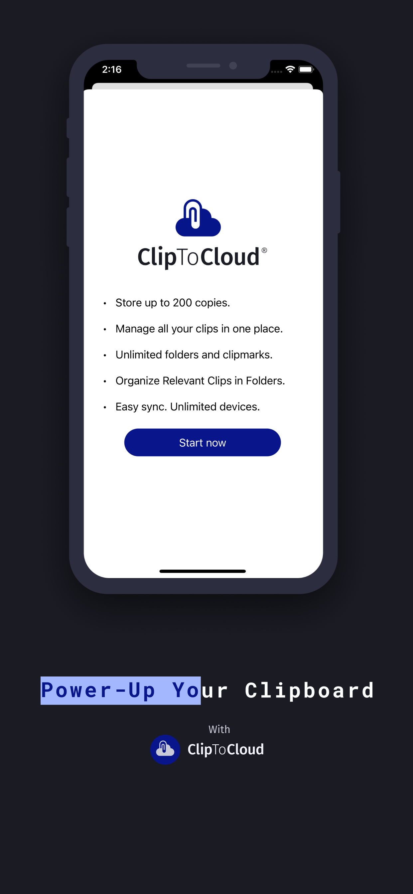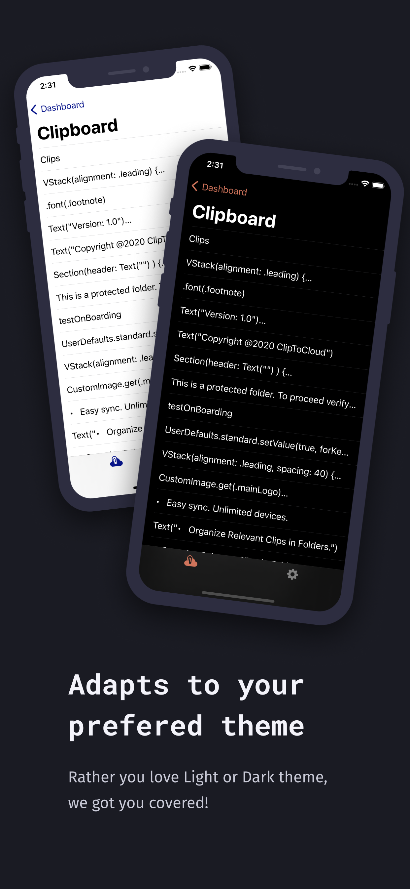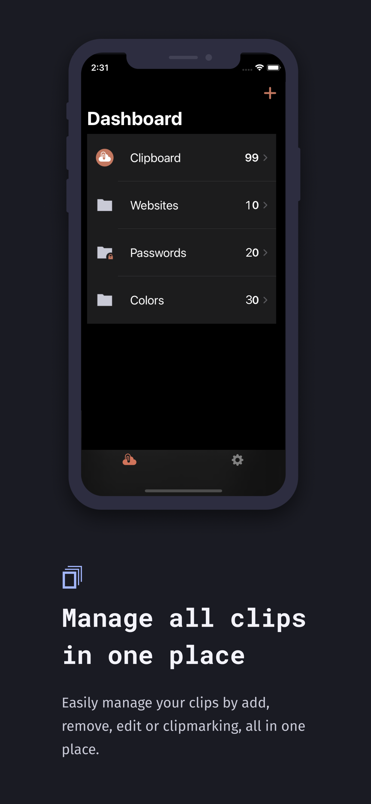

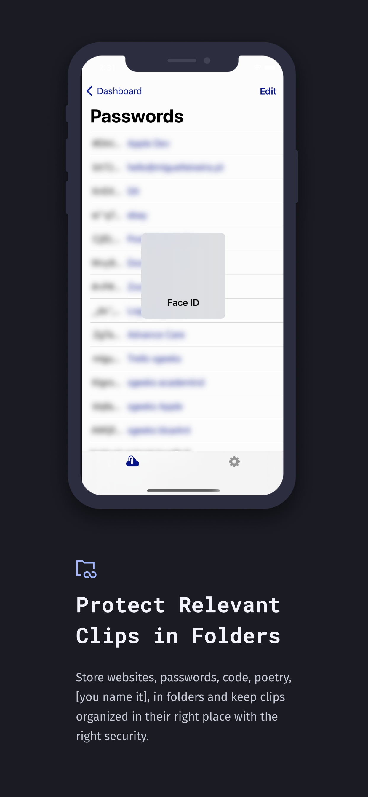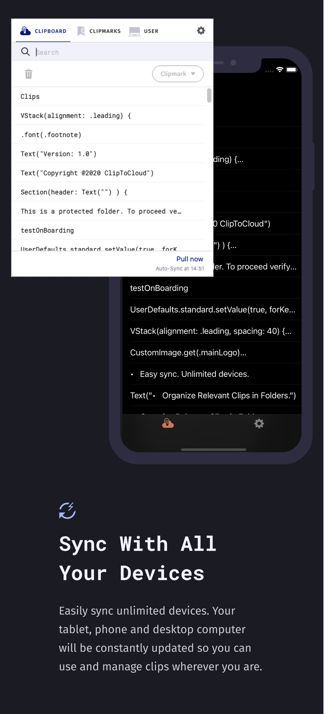

## Calendall 

 

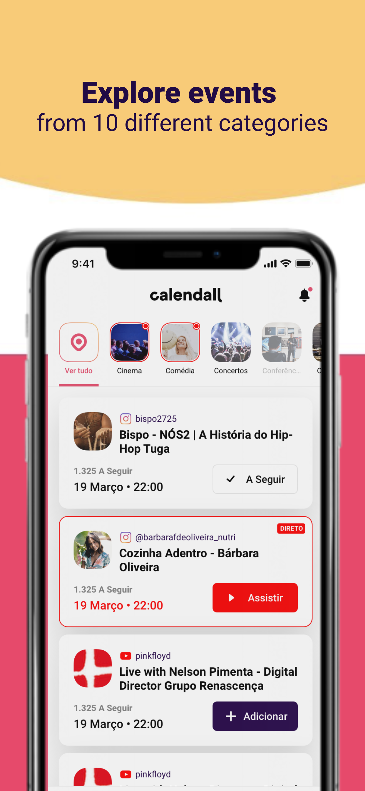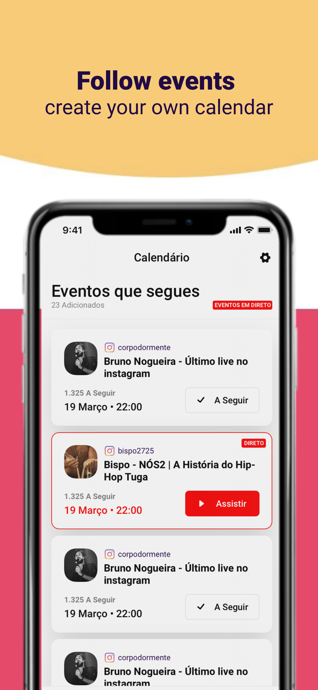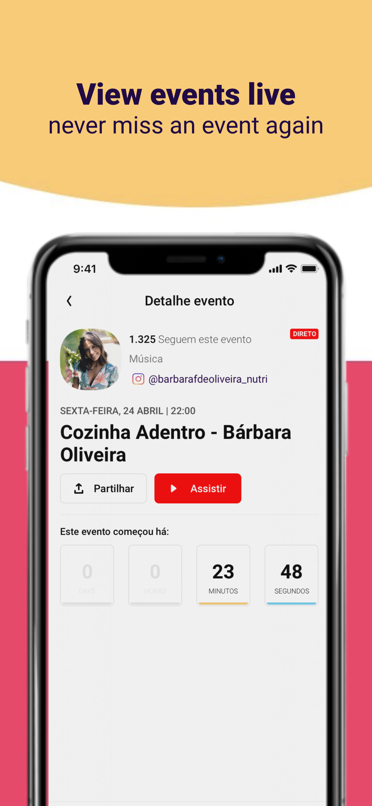
